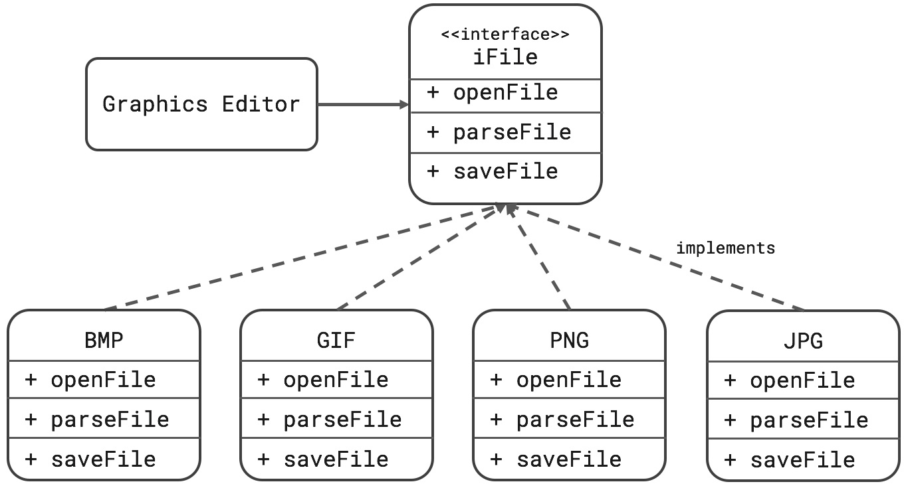

# Bài tập thiết kế clean code trong OOP
## Code theo thiết kế như hình bên dưới



## Chi tiết các lớp
1. Interface IFile chứa các menthod chung
```
public interface IFile {
    public void openFile(String fileName);

    public void parseFile();

    public void saveFile();

    public String getExtension();

}
```

2. Các lớp Bmp.java, Gif.java, Jpg.java, Png.java implement IFile
- VD: 
```
public class Jpg implements IFile {
  public final String EXTENSION = "jpg";
  private String fileOpenned;

  public void setFileOpenned(String fileOpenned) {
    this.fileOpenned = fileOpenned;
  }

  public String getFileOpenned() {
    return fileOpenned;
  }

  public String getExtension() {
    return EXTENSION;
  }

  @Override
  public void openFile(String fileName) {
    setFileOpenned(fileName);
    System.out.println(EXTENSION + ":  openF " + fileName);

  }

  @Override
  public void parseFile() {
    System.out.println(EXTENSION + ": readF");

  }

  @Override
  public void saveFile() {
    if (fileOpenned != null) {
      System.out.println(EXTENSION + ":  saveF");
    } else {
      System.out.println("Nothing to save");
    }

  }
}
```

3. Lớp GraphicsEditor 
```
public void openFile(String fileName) throws Exception {
    String extension = fileName.substring(fileName.length() - 3);
    files.add(bmp);
    files.add(gif);
    files.add(png);
    files.add(jpg);

    for (IFile iFile : files) {
      if (iFile.getExtension().equals(extension)) {
        iFile.openFile(fileName);
      }
    }

  }
```


